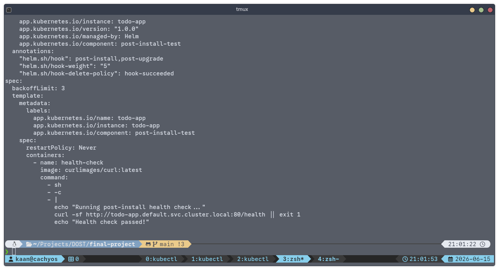
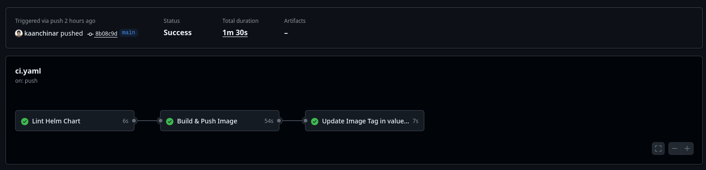
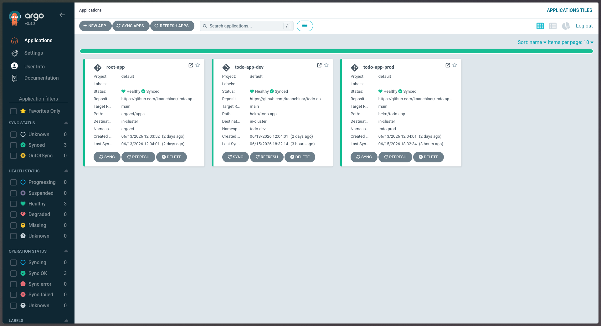
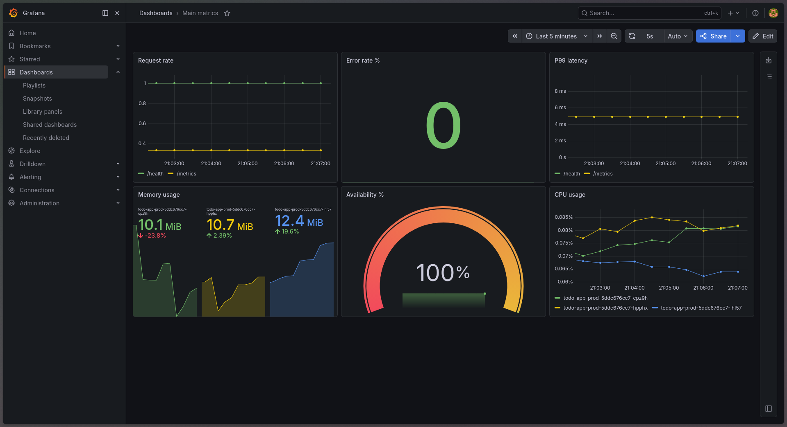
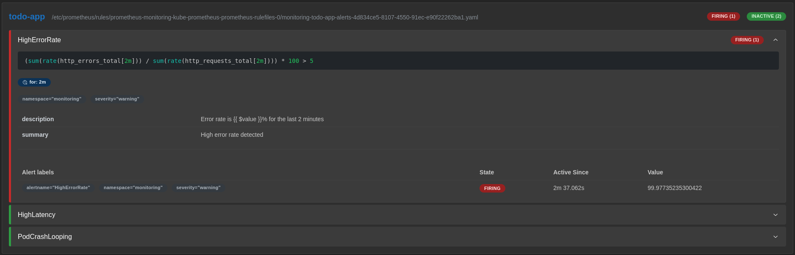
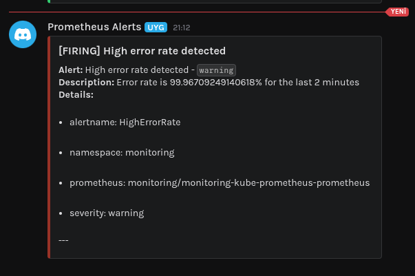

# todo-api-go
Simple backend To-Do API written in Go and Chi framework, with full CI/CD pipeline


## Layihə Haqqında
Bu sənəd mənim **TODO-App** layihəsini (lab-ı) sıfırdan necə qurduğumu və konfiqurasiya etdiyimi addım-addım göstərən texniki dokumentasiyadır. Hər bir mərhələdə icra edilən əmrlər, onların nəticələri və arxitektura sübutları (şəkillər) aşağıda öz əksini tapmışdır.

---

## Mərhələ 1: Tətbiq və Paketləmə (App & Packaging)

### 1. Tətbiqin Yazılması və Dockerize Edilməsi
İlk olaraq Go (Chi) ilə `/`, `/health` və `/metrics` endpointlərinə sahib API yazdım. Tətbiqi paketləmək üçün multi-stage `Dockerfile` hazırladım. İmicin həcminin 100MB-dan kiçik olmasını təmin etdim.

Tətbiqin imicini yığmaq və həcmini yoxlamaq üçün icra etdiyim əmr:
```bash
docker build -t ghcr.io/kaanchinar/todo-api-go:latest ./src
docker images | grep todo-api-go
```

```console
[+] Building 1.9s (18/18) FINISHED                                                                                          docker:default
=> [internal] load build definition from Dockerfile                                                                                  0.0s
=> => transferring dockerfile: 534B                                                                                                  0.0s
=> [internal] load metadata for docker.io/library/golang:1.22-alpine                                                                 1.4s
=> [internal] load metadata for docker.io/library/alpine:3.19                                                                        1.4s
=> [internal] load .dockerignore                                                                                                     0.0s
=> => transferring context: 125B                                                                                                     0.0s
=> [builder 1/7] FROM docker.io/library/golang:1.22-alpine@sha256:1699c10032ca2582ec89a24a1312d986a3f094aed3d5c1147b19880afe40e052   0.0s
=> => resolve docker.io/library/golang:1.22-alpine@sha256:1699c10032ca2582ec89a24a1312d986a3f094aed3d5c1147b19880afe40e052           0.0s
=> [internal] load build context                                                                                                     0.1s
=> => transferring context: 28.69MB                                                                                                  0.1s
=> [stage-1 1/5] FROM docker.io/library/alpine:3.19@sha256:6baf43584bcb78f2e5847d1de515f23499913ac9f12bdf834811a3145eb11ca1          0.1s
=> => resolve docker.io/library/alpine:3.19@sha256:6baf43584bcb78f2e5847d1de515f23499913ac9f12bdf834811a3145eb11ca1                  0.0s
=> CACHED [stage-1 2/5] RUN apk add --no-cache ca-certificates                                                                       0.0s
=> CACHED [stage-1 3/5] RUN adduser --disabled-password --no-create-home appuser                                                     0.0s
=> CACHED [stage-1 4/5] WORKDIR /app                                                                                                 0.0s
=> CACHED [builder 2/7] RUN apk add --no-cache git ca-certificates                                                                   0.0s
=> CACHED [builder 3/7] WORKDIR /app                                                                                                 0.0s
=> CACHED [builder 4/7] COPY go.mod go.sum ./                                                                                        0.0s
=> CACHED [builder 5/7] RUN go mod download                                                                                          0.0s
=> CACHED [builder 6/7] COPY . .                                                                                                     0.0s
=> CACHED [builder 7/7] RUN CGO_ENABLED=0 GOOS=linux GOARCH=amd64 go build     -ldflags="-w -s"     -o /todo-app     .               0.0s
=> CACHED [stage-1 5/5] COPY --from=builder /todo-app .                                                                              0.0s
=> exporting to image                                                                                                                0.1s
=> => exporting layers                                                                                                               0.0s
=> => exporting manifest sha256:bdf07945f6b7abb26752662003e261168dfbbee70badcb7607863a11815a2ff4                                     0.0s
=> => exporting config sha256:014f4fbecb1191fad3eb3ff9e5736cbdb9c239e6638577a9145d532b2cda6021                                       0.0s
=> => exporting attestation manifest sha256:4a373b38d862dabf7fbf4fe7b82764cfae35ad0b91d7bfb2ff74dd83df7db626                         0.0s
=> => exporting manifest list sha256:322968b31eafb9f6ec90958edcceb57bbdde59b05a1d761bb30dd8ef1eb83e7e                                0.0s
=> => naming to ghcr.io/kaanchinar/todo-api-go:latest                                                                                0.0s
=> => unpacking to ghcr.io/kaanchinar/todo-api-go:latest                                                                             0.0s
ghcr.io/kaanchinar/todo-api-go:latest                                                                 322968b31eaf       38.7MB         9.96MB
ghcr.io/kaanchinar/todo-api-go:sha-9e23d1f74ec6199c19f38de0dff7eab45fc4a7cd                           95878cc0d477       38.7MB         9.98MB
```

### 2. Helm Chart Yaradılması
Kubernetes-ə deploy etmək üçün Helm chart yaratdım və gərəksiz faylları təmizlədim:
```bash
helm create helm/todo-app
```
`values-dev.yaml` (1 replika) və `values-prod.yaml` (3 replika, HPA) fayllarını hazırladım.

Helm chart-ın xətasız olduğunu yoxlamaq üçün `lint` və `template` əmrlərini icra etdim:
```bash
helm lint helm/todo-app
```
```console
==> Linting helm/todo-app
[INFO] Chart.yaml: icon is recommended

1 chart(s) linted, 0 chart(s) failed
```

```bash
helm template todo-app helm/todo-app -f helm/todo-app/values-dev.yaml
```


---

## Mərhələ 2: CI/CD və GitOps

### 1. GitHub Actions Pipeline
Kodu repo-ya push edəndə avtomatik olaraq Helm lint edən, Docker imicini yığıb GHCR-ə göndərən və `values-prod.yaml`-da `image.tag`-i yeniləyən `.github/workflows/ci.yaml` faylı yazdım.



### 2. ArgoCD ilə GitOps
Klasterə ArgoCD quraşdırdım. App-of-Apps modeli ilə `dev` və `prod` mühitlərini avtomatik idarə etmək üçün `root-app.yaml` manifestini klasterə apply etdim:

```bash
kubectl apply -f argocd/root-app.yaml
```



---

## Mərhələ 3: İzləmə (Observability)

Prometheus və Grafana ekosistemini klasterə quraşdırdım. Tətbiqin `/metrics` endpoint-dən məlumat çəkmək üçün `ServiceMonitor` manifestini tətbiq etdim. 

```bash
kubectl get servicemonitor -n monitoring
```
```console
NAME                                                 AGE
monitoring-grafana                                   45h
monitoring-kube-prometheus-alertmanager              45h
monitoring-kube-prometheus-apiserver                 45h
monitoring-kube-prometheus-coredns                   45h
monitoring-kube-prometheus-kube-controller-manager   45h
monitoring-kube-prometheus-kube-etcd                 45h
monitoring-kube-prometheus-kube-proxy                45h
monitoring-kube-prometheus-kube-scheduler            45h
monitoring-kube-prometheus-kubelet                   45h
monitoring-kube-prometheus-operator                  45h
monitoring-kube-prometheus-prometheus                45h
monitoring-kube-state-metrics                        45h
monitoring-prometheus-node-exporter                  45h
todo-app-monitor                                     22h
```

Grafana-da xüsusi PromQL sorğuları (Request rate, Error rate, P99 latency, Availability) ilə dashboard yığdım.



---

## Mərhələ 4: Xəbərdarlıq və Yük Testi (Alerting & Load Testing)

Sistemdə yaranan problemlər (HighErrorRate, HighLatency) üçün `PrometheusRule` yaratdım və Slack/Discord webhook-u Alertmanager-ə inteqrasiya etdim.

### 1. Normal Yük Testi (Load Testing)
Tətbiqə `hey` aləti ilə normal yük verdim:
```bash
hey -z 30s -c 50 http://todo.local/
```
```console
Summary:
  Total:	30.0023 secs
  Slowest:	0.0661 secs
  Fastest:	0.0002 secs
  Average:	0.0031 secs
  Requests/sec:	16163.1469

  Total data:	18427378 bytes
  Size/request:	38 bytes

Response time histogram:
  0.000 [1]	|
  0.007 [454247]	|■■■■■■■■■■■■■■■■■■■■■■■■■■■■■■■■■■■■■■■■
  0.013 [22819]	|■■
  0.020 [5435]	|
  0.027 [1575]	|
  0.033 [472]	|
  0.040 [202]	|
  0.046 [100]	|
  0.053 [37]	|
  0.059 [36]	|
  0.066 [7]	|


Latency distribution:
  10%% in 0.0011 secs
  25%% in 0.0016 secs
  50%% in 0.0023 secs
  75%% in 0.0036 secs
  90%% in 0.0055 secs
  95%% in 0.0076 secs
  99%% in 0.0160 secs

Details (average, fastest, slowest):
  DNS+dialup:	0.0000 secs, 0.0000 secs, 0.0015 secs
  DNS-lookup:	0.0000 secs, 0.0000 secs, 0.0010 secs
  req write:	0.0000 secs, 0.0000 secs, 0.0021 secs
  resp wait:	0.0031 secs, 0.0002 secs, 0.0661 secs
  resp read:	0.0000 secs, 0.0000 secs, 0.0014 secs

Status code distribution:
  [200]	484931 responses
```

### 2. Xəta Yük Testi və Alert
Xəta sayını süni şəkildə artırmaq üçün olmayan endpoint-ə yük göndərdim:
```bash
hey -z 30s -c 100 http://todo.local/nonexistent
```





---

## Mərhələ 5: Dayanıqlıq və Doğrulama (Resilience & Validation)

### 1. Helm Hook ilə Post-install test
Deploydan dərhal sonra containerin ayağa qalxmasını yoxlamaq üçün `post-install-test.yaml` Job-u yazdım.
```bash
kubectl get jobs -n todo-prod
```
```console
NAME                         STATUS    COMPLETIONS   DURATION   AGE
todo-app-post-install-test   Running   0/1           6s         6s
todo-app-post-install-test   Running   0/1           12s        12s
todo-app-post-install-test   Running   0/1           16s        16s
todo-app-post-install-test   Running   0/1           16s        16s
todo-app-post-install-test   Running   0/1           33s        33s
todo-app-post-install-test   SuccessCriteriaMet   0/1           37s        37s
todo-app-post-install-test   Complete             1/1           37s        37s
todo-app-post-install-test   Complete             1/1           37s        37s
```

---

## Mərhələ 6: Yekun Yoxlama (Final Verification)

Bütün layihənin təhlükəsizlik qaydalarına uyğun olduğunu yoxladım. `values-dev.yaml` və `values-prod.yaml` fayllarında heç bir həssas məlumatın (şifrə/token) düz mətn (plain-text) olaraq qalmadığından əmin oldum:

```bash
rg -n 'password|secret|token|key' helm/todo-app/values-dev.yaml helm/todo-app/values-prod.yaml
```
```
helm/todo-app/values-prod.yaml
25:  password: ""  # Set via --set or secrets
40:  password: ""  # Set via --set or secrets

helm/todo-app/values-dev.yaml
22:  password: "" # Set via --set or secrets
36:  password: ""
```

**Nəticə:** Layihə tam olaraq başa çatdırılmış, CI/CD axını sınaqdan keçirilmiş və dayanıqlı GitOps infrastrukturu təmin edilmişdir.
